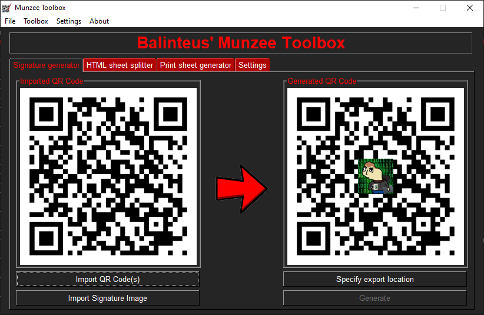
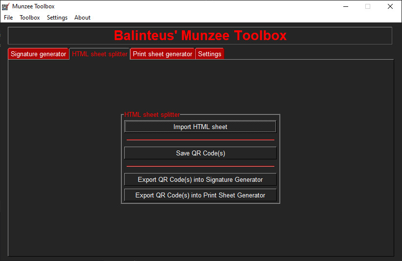
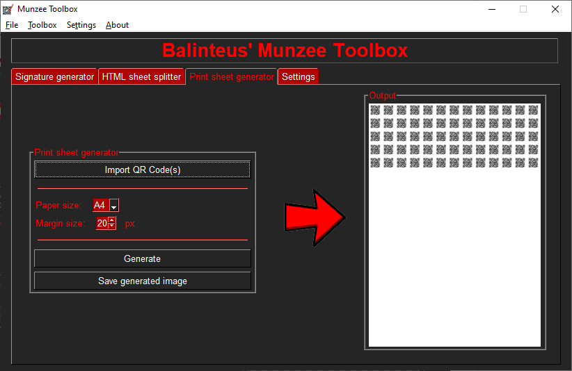

# Munzee Toolbox
A desktop tool to spice up your QR codes with your own signature images and more useful utilities to make Munzeeing easier.

## Features

### Signature genrator
Puts a user defined image in the middle of your QR codes.

### HTML sheet splitter
Extracts all the QR code images from a Batch Print HTML file (that was generated from: <https://munzee.com/print>).

### Print sheet generator
Generates a print sheet from the given Munzees.

## License
This project is distributed under the MIT License. See `LICENSE` for more information.
